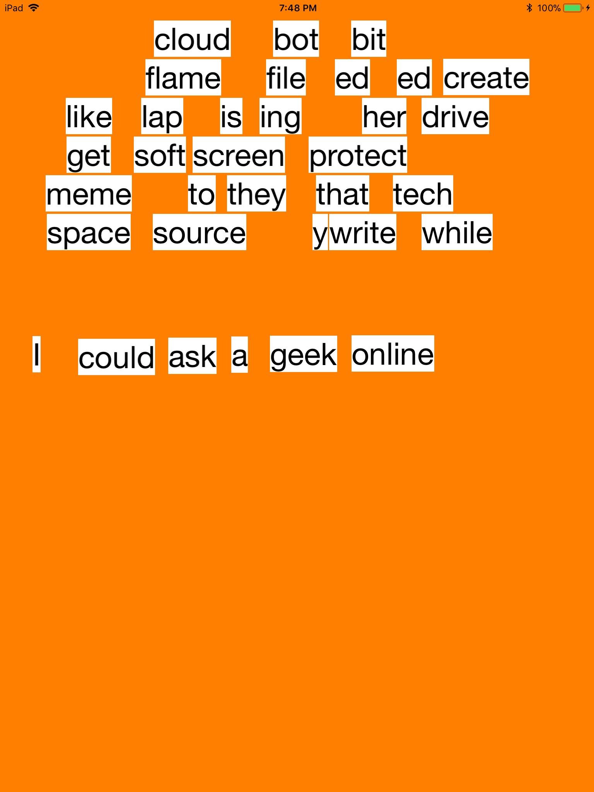
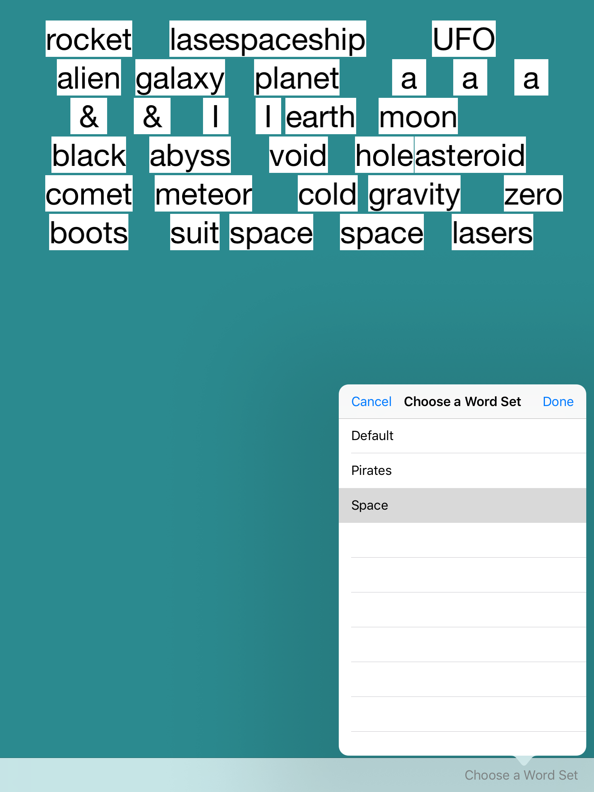

# Word River
Irvin Do and Kyle Lekkas

Poem builder flowing at your fingertips

## Features (Proposed)

1. Snap-to-Grid, Resizability, and Rotation for easier word styling and formatting.

2. A continuous stream of words for the user to choose from.

3. Save and Share the poem.

## Checkpoint 1 ##

### Sketches and Screenshots ###

Checkpoint 1 - App View, labels are sized to 40pt and starts from top left going left to right, top to bottom.

### Current Implemented Features ###

1. Words have been resized to 40pt font

2. Words will now be initally placed from top left and placed left to right, top to bottom.

3. Start-up Screen Added.

4. App-Icon Created.

## Checkpoint 2 ##

### Sketches and Screenshots ###

### Current Implemented Features ###

1. All errors and issues per instructor's comments have been fixed

2. Table View Controller has been added and from the view controller, you can select a word set and have it load a word list based on the set chosen.

3. App renamed to Word River and App Name on device will reflect the changes.

4. Status Bar is hidden. 

### Upcoming ###

1. Checkpoint 3 requirements
2. Extra Features we planned
